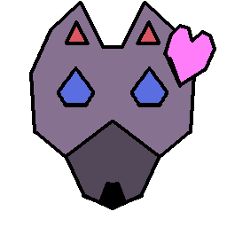

# 2074 - United Planets Research Center 5

## For years, development on consumer-grade magnetic vehicales has stalled. We have been able to achieve levitation and supported locomotion independently, but combining them has proved a physical impossibility in the required frame size. The problem is the attractor electromagnets interfere with the repellor electromagnets, as illustrated below.

{ height=25% }

# However, the dark age of transportation ends today.

# Introducing...

---

# An intitiave by
{ height=25% }
{ height=25% }

---

# With the collaboration of
{ height=25% }
{ height=25% }

---

# A game by Nomagno et. al.

# Halfive Universal Championship

{ height=35% }

[GAME INTRO GOES HERE]: #

---

# Meet the big players:

## [Halfive Universal Championship](Halfive_Championship.md)
{ height=15% }

## Main sponsor and technology partner: [Sheewol Electronics](Sheewol.md)
{ height=15% }

## Biggest console manufacturer: [Sheewol Gaming](Sheewol_Gaming.md)
{ height=15% }

## Popular videogame developer: [Plumber and Hedgehog](Plumber_and_Hedgehog.md)
{ height=15% }

## Friendly social media giant *UwU*: [DAIDAI in your area!!](DAIDAI.md)
{ height=15% }

## Track-building partner: [BOD-DHA Construction](BODDHA.md)
{ height=15% }

## Telecommunications partner: [Tulipán Networking](Tulipan_Networking.md)
{ height=15% }

## Logistics service: [Loong Cargo](Loong_Cargo.md)
{ height=15% }

## Official event sanctioners: [United Planets](United_Planets.md)
{ height=15% }
